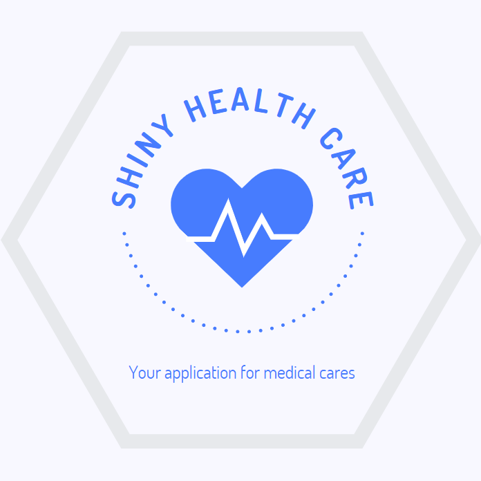

# Shiny Health Care Application

You can see the nutritional information,
See your BMI, measure your sleep schedule
and your pressure.

For utilize the program, just run 
runApp() on the R console

In case of spelling mistakes:
options(encoding = 'UTF-8')

For using the application, enter the website https://andremiyazawa08.shinyapps.io/ShinyHealthCare/

